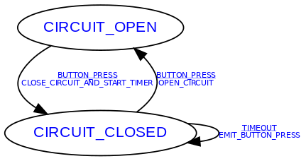

# Fsm.h

This is a standalone single-file header only library for creating Fsms.  Please refer to the
example for usage.

The benefits of this Fsm over alternatives

* No code wizard involved so there is no need to edit auto-generated source files
* State/Event pairs map to Actions rather than states having an `enter` and an `exit` that is always
run - this makes it possible to avoid destroying reinitializations which are not required by the
state transition.
* No heap is used making this safe for heap-free embedded environments
* Simple usage for main loop: a single FSM object with an `inject_event` method.
* Ability to autogenerate graph in a PNG file directly from the header that defines the FSM table.

# Building the example fsm

```sh
cd example/
cmake -S . -B build
cd build/
make
```

# Running the example fsm
```sh
./example/build/example
```

# Rebuilding the output PNG
```sh
cd example/
../tools/gen_graph -i ExampleFsmTable.h -c ExampleFsmTable -o ExampleFsm.png
```

This should produce an image file like this


